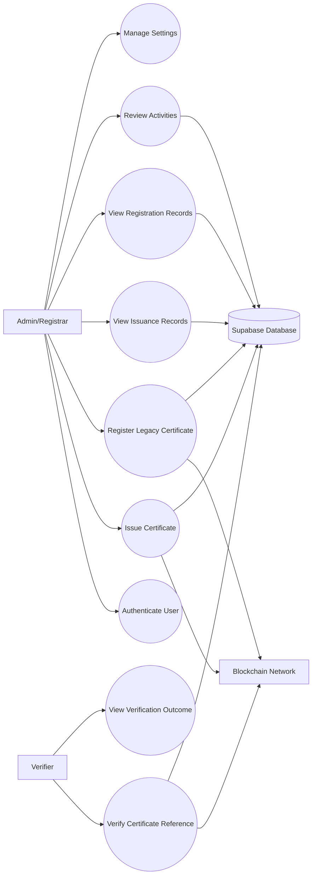
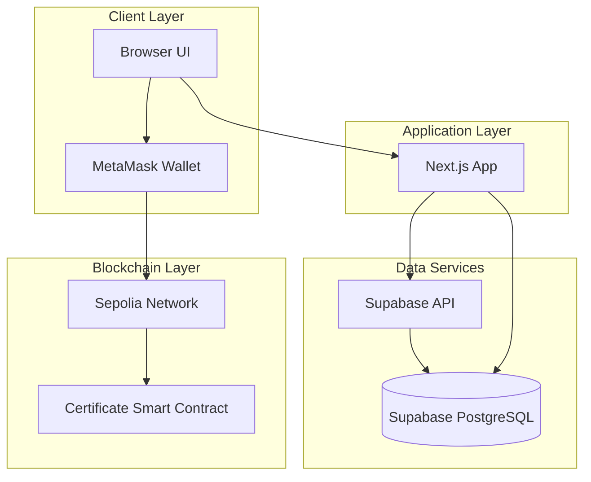
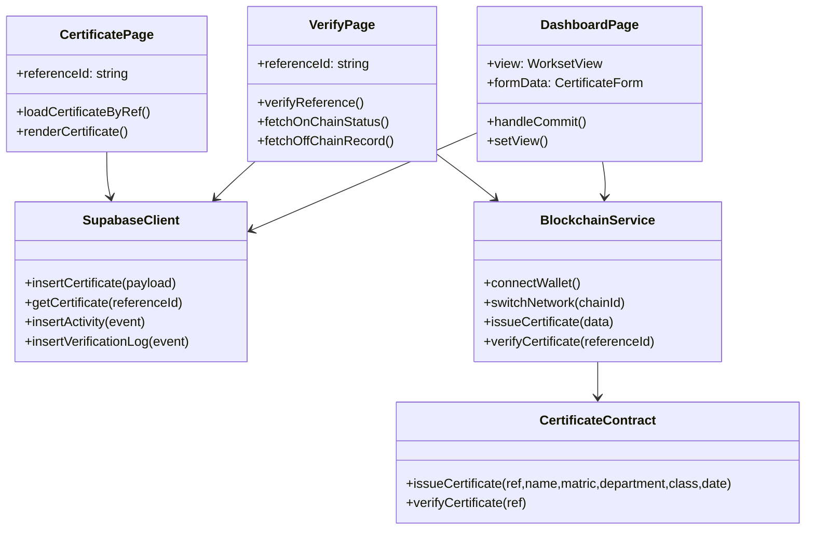
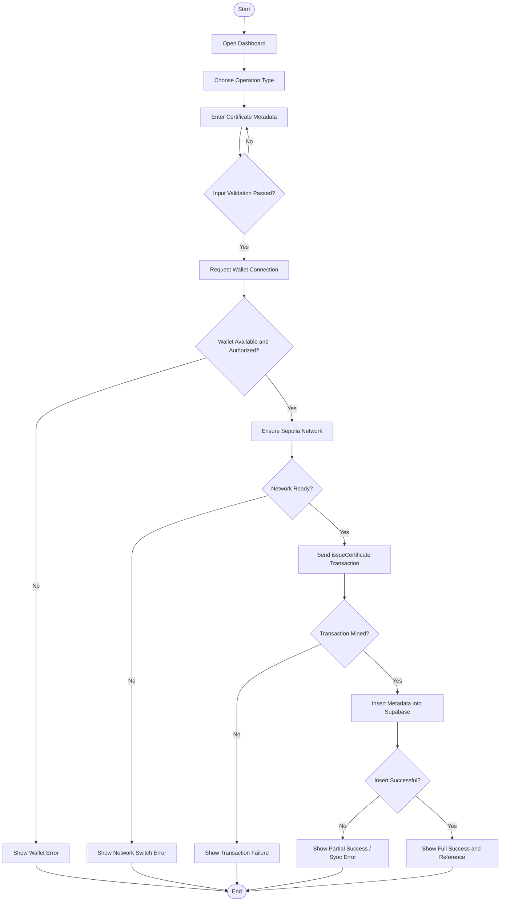

# CHAPTER THREE
## RESEARCH METHODOLOGY

## 3.0 SYSTEM ANALYSIS AND DESIGN
This chapter presents the methodology used to analyze the current certificate management process and to design the proposed blockchain certificate verification system. The chapter is structured to move from problem understanding to technical design, showing how each design decision directly addresses a weakness found in the existing process. The method adopted combines classical systems analysis (problem identification, requirement capture, and process modeling) with modern distributed-system design (blockchain transaction flow, API-based data synchronization, and cloud database architecture).

The approach used in this study is practical and implementation-oriented. Instead of treating analysis and design as abstract theory, each section maps directly to elements that can be implemented in software. The proposed system is web-based, uses a smart contract for tamper-evident anchoring, and uses Supabase/PostgreSQL for searchable and reportable records. The methodology therefore reflects both academic design standards and real deployment considerations such as network reliability, transaction latency, and operational monitoring.

### 3.1 System Analysis

System analysis in this project focuses on answering five core questions:
1. What currently exists?
2. What is wrong with it?
3. Why should a new system be introduced?
4. What should the new system do?
5. How should the new system behave in realistic institutional workflows?

To answer these questions, the analysis considered typical university processes for issuing and validating certificates, interview-style requirement assumptions for registrar offices, and practical needs of external verifiers such as employers and admission officers. The findings show that while many institutions already use computers, their verification model is still trust-based and centrally dependent rather than cryptographically verifiable.

#### 3.1.1 Analysis of the Existing System
The existing certificate process is mostly centralized and institution-dependent. Even when records are stored digitally, trust in the certificate depends on whether the verifier can contact the institution and whether the institution can retrieve matching records quickly. In many cases, certificates are printed as static documents with visible fields (name, matric number, department, class of degree, date) and physical signatures or stamps. These attributes can be copied, altered, or recreated using document editing tools.

From a systems perspective, the present approach often has the following operating pattern:
- Student completes program and institution generates certificate.
- Certificate metadata is stored in a local registry (paper, spreadsheet, or internal software).
- Third party submits verification request by email, letter, call, or portal.
- Staff manually checks the registry and replies.
- A response is issued, often without cryptographic proof that the record was never modified.

This process creates dependency on human availability and institutional response time. Verification quality therefore varies with administrative capacity, staffing levels, and archival quality. If the institution has poor indexing or record migration issues, even valid certificates can face delayed verification. If records are altered internally without strict audit controls, discovering unauthorized changes can be difficult.

Another important observation is that current systems are typically not designed for independent public verification. A verifier should ideally be able to validate a certificate reference immediately, without writing to the issuing institution and waiting for confirmation. In the legacy model, this is rarely possible because records are not published in a trust-minimized environment and do not carry immutable state proofs.

In summary, the existing system is functional for issuance but weak for transparent, fast, and tamper-evident verification at scale.

#### 3.1.2 Limitation of the Existing System
The existing model has technical, operational, and trust limitations. These limitations are not isolated; they interact and amplify each other.

**1. Forgery and document manipulation risk**  
Traditional certificates can be forged by reproducing layout, logos, signatures, and text fields. Even digitally generated PDFs can be edited and re-exported. Without a cryptographic reference that can be checked against an immutable ledger, verifiers cannot independently prove authenticity.

**2. Weak non-repudiation**  
In many systems, it is difficult to prove that a record was issued at a specific time and has remained unchanged since that point. Administrative logs may exist, but they can be altered by privileged users or lost during migration.

**3. Single point of trust and failure**  
Centralized storage means one institution or one server environment determines truth. If the server is down, data is corrupted, credentials are compromised, or records are accidentally deleted, verification becomes unavailable or unreliable.

**4. Manual verification bottlenecks**  
Verification requests create repetitive administrative load. During peak periods (employment seasons, postgraduate applications), response delays increase significantly. This affects both institutional reputation and user satisfaction.

**5. Poor interoperability and standardization**  
Different departments may use inconsistent formats and identifiers, making cross-department auditing and analytics difficult. A verifier interacting with multiple institutions also faces inconsistent validation procedures.

**6. Auditability gaps**  
Many legacy systems do not retain complete event-level audit trails with immutable timestamps. Even when logs exist, they are often not linked to a secure evidence chain.

**7. Limited scalability for digital transformation goals**  
As graduate populations grow, manual and semi-manual processes become expensive. Institutions seeking digital-first service delivery need self-service verification channels and machine-readable records.

**8. Trust friction for external stakeholders**  
Employers and partner institutions must rely on correspondence rather than evidence. This creates uncertainty, especially in cross-border recruitment or admissions where institutional familiarity is low.

These limitations establish the need for a system that supports immutable proof, real-time validation, and structured off-chain indexing.

#### 3.1.3 Justification for the New System
The new system is justified on functional, security, governance, and institutional efficiency grounds.

**Functional justification:**  
The institution needs a platform that can both issue and verify certificates digitally in near real time. The proposed system allows authorized users to create certificate records and immediately anchor proof on-chain. Verifiers can validate by reference without waiting for human response.

**Security justification:**  
Blockchain anchoring introduces tamper-evidence. Once a certificate reference and related data point are committed through a transaction, retroactive alteration is impractical without consensus-level attack. This significantly raises trust compared with editable centralized records.

**Governance and audit justification:**  
A dual-layer model (on-chain proof + off-chain relational records) enables auditable operations. On-chain state provides immutable anchors, while Supabase provides queryable records for reporting, compliance checks, and dashboard analytics.

**Operational justification:**  
The system reduces repetitive manual verification workload, improves service turnaround, and supports self-service checks for external parties. Staff can focus on exception handling rather than routine confirmation.

**Strategic justification:**  
The architecture positions the institution for broader digital credential initiatives, including interoperable verification portals, external API integration, and eventual migration from testnet to production-grade blockchain deployment.

**Economic justification:**  
Although blockchain writes carry transaction costs, the long-term operational savings from reduced manual handling, faster verification, and improved trust can offset these costs, especially when scaled across multiple graduating cohorts.

Therefore, the new system is not only a technical upgrade; it is an institutional trust and efficiency upgrade.

#### 3.1.4 Description of the New System
The proposed system is a web-based blockchain certificate issuance and verification platform built with Next.js, Ethereum smart contract interaction via `ethers`, and Supabase for relational data storage.

At a high level, the system has four cooperating layers:
1. **Presentation Layer (Frontend):** pages for login, dashboard operations, certificate display, and verification.
2. **Application Layer (Client logic + API interactions):** validation logic, flow orchestration, and error handling.
3. **Blockchain Layer:** wallet-driven transaction signing and smart contract calls on Sepolia.
4. **Data Layer:** Supabase tables for certificate metadata, activity logs, and query operations.

The operational flow for issuance is:
1. Admin/Registrar selects issuance mode and provides certificate details.
2. System validates required fields (name, matric number, department, class, date).
3. Browser wallet is requested and connected.
4. Network is checked/switched to Sepolia.
5. Smart contract `issueCertificate(...)` is called.
6. Transaction confirmation is awaited.
7. On success, metadata is inserted into Supabase for indexing.
8. User receives status feedback and certificate reference.

The operational flow for verification is:
1. Verifier enters or opens a certificate reference.
2. System retrieves related data and on-chain status.
3. Output indicates whether the certificate is valid, not found, or inconsistent.
4. Verification event may be logged for analytics and monitoring.

Key design principle: **on-chain data for trust, off-chain data for usability**.  
Storing all rich details directly on-chain is expensive and difficult to query at scale; storing all details only off-chain weakens tamper guarantees. The hybrid model balances integrity, cost, and performance.

The proposed system also includes user-facing reliability behavior:
- If blockchain transaction fails, no false success message is shown.
- If database synchronization fails after successful chain write, user is informed of partial success.
- Errors are explicit enough to support troubleshooting (network issues, wallet rejection, configuration faults).

This behavior is crucial for real-world deployment because distributed workflows can fail at different points (wallet, chain, network, or database). A robust system must represent these states accurately.

---

### 3.2 Design of the Proposed System
The design section translates analysis outcomes into formal models. This includes data structures, actor interactions, deployment architecture, component relationships, and use-case workflow dynamics.

#### 3.2.1 Data Model (ERD translated to schema, normalized to at least 3NF)
The data model is designed to maintain data integrity, minimize redundancy, and support efficient queries for issuance history and verification events. The model separates master entities (users, certificates) from event entities (verification logs, activities), which is consistent with 3NF principles.

##### Entity Rationale
**users** represents system operators and role-bearing identities.  
**certificates** represents canonical issued or registered certificate records.  
**verification_logs** captures each verification event as a time-stamped occurrence.  
**activities** stores generalized operational logs for dashboard and audit support.

##### Proposed Relational Schema

1. **users**
- `id` UUID PRIMARY KEY DEFAULT `gen_random_uuid()`
- `username` VARCHAR(100) UNIQUE NOT NULL
- `email` VARCHAR(150) UNIQUE NOT NULL
- `role` VARCHAR(50) NOT NULL
- `created_at` TIMESTAMPTZ DEFAULT `timezone('utc', now())`

2. **certificates**
- `id` UUID PRIMARY KEY DEFAULT `gen_random_uuid()`
- `reference_id` VARCHAR(50) UNIQUE NOT NULL
- `student_name` VARCHAR(200) NOT NULL
- `matric_number` VARCHAR(100) NOT NULL
- `department` VARCHAR(150) NOT NULL
- `class_of_degree` VARCHAR(120) NOT NULL
- `date_issued` DATE NOT NULL
- `tx_hash` VARCHAR(120)
- `action_type` VARCHAR(20) NOT NULL
- `issued_by` UUID REFERENCES `users(id)`
- `created_at` TIMESTAMPTZ DEFAULT `timezone('utc', now())`

3. **verification_logs**
- `id` UUID PRIMARY KEY DEFAULT `gen_random_uuid()`
- `certificate_id` UUID NOT NULL REFERENCES `certificates(id)` ON DELETE CASCADE
- `verified_at` TIMESTAMPTZ NOT NULL DEFAULT `timezone('utc', now())`
- `verifier_ip` VARCHAR(64)
- `status` VARCHAR(20) NOT NULL
- `verification_channel` VARCHAR(50)

4. **activities**
- `id` UUID PRIMARY KEY DEFAULT `gen_random_uuid()`
- `action` TEXT NOT NULL
- `details` TEXT NOT NULL
- `url` TEXT
- `timestamp` TIMESTAMPTZ NOT NULL DEFAULT `timezone('utc', now())`

##### Candidate Keys and Constraints
- `certificates.reference_id` is unique and used as public verification key.
- `users.email` and `users.username` are unique to avoid account ambiguity.
- Foreign key integrity ensures logs cannot refer to non-existent certificates.
- Enumerated-like fields (`role`, `status`, `action_type`) can be constrained further via `CHECK` constraints for stricter data quality.

##### Indexing Suggestions
- Index `certificates(reference_id)` for fast lookup by verifier.
- Composite index on `certificates(matric_number, date_issued)` for administrative searches.
- Index `verification_logs(certificate_id, verified_at)` for chronological audit views.
- Index `activities(timestamp)` for dashboard timeline queries.

##### 3NF Normalization Explanation
**First Normal Form (1NF):**  
All attributes are atomic. No repeating groups (e.g., multiple verification events are not stored in one row; they are separate rows in `verification_logs`).

**Second Normal Form (2NF):**  
Non-key attributes fully depend on the whole primary key in each table. There are no partial dependencies because each table uses a single-column surrogate key (`id`).

**Third Normal Form (3NF):**  
No non-key attribute depends transitively on another non-key attribute. For example:
- User details are stored in `users`, not duplicated in `certificates`.
- Verification event metadata is separated in `verification_logs`.
- Activity narrative is separated into `activities` rather than overloading certificate rows.

The model therefore satisfies 3NF and supports extensibility for future modules.

#### 3.2.2 Functional Requirement (Use Case Diagram)
Functional requirements define what the system must do from the perspective of different actors.

##### Actors
1. **Admin/Registrar:** authorized institutional operator.
2. **Verifier:** employer, institution, or member of the public checking validity.
3. **Blockchain Network:** external execution and state persistence environment.
4. **Supabase Database:** external managed data service for off-chain records.

##### Core Functional Requirements
**For Admin/Registrar**
- Authenticate and access dashboard.
- Issue new certificate to blockchain.
- Register historical/legacy certificate.
- View lists of issued and registered certificates.
- Review operational activities and system state.
- Manage configurable settings.

**For Verifier**
- Search by certificate reference.
- View verification result and certificate details.
- Confirm whether certificate state matches expected validity.

**System-Level Functions**
- Detect and report wallet/network errors.
- Prevent false success states when one step fails.
- Persist logs for audit and troubleshooting.
- Support link-based certificate access and verification.

##### Use Case Interpretation
The diagram shows that issuance and registration are not purely blockchain actions; they are dual writes with consistency implications. Verification may use both on-chain and off-chain sources. This design enables both cryptographic trust (chain) and practical application utility (database querying, filtering, pagination, logs).

#### 3.2.3 System/Network Architecture (Deployment Diagram)
The architecture is a distributed web application model with clear separation of concerns between client execution, application logic, database services, and blockchain network.

##### Architecture Explanation
**Client Layer:**  
Users interact with the dashboard and verification screens through a browser. Wallet interaction is managed by MetaMask for signing blockchain transactions.

**Application Layer:**  
Next.js handles UI rendering, route management, input validation, and orchestration of calls to both Supabase and blockchain providers.

**Data Services Layer:**  
Supabase provides managed Postgres and API interfaces for data persistence and retrieval. This layer is optimized for queries and analytics.

**Blockchain Layer:**  
Sepolia hosts the certificate smart contract during development/testing. Contract calls provide immutable issuance evidence and verifier trust anchors.

##### Security and Reliability Considerations
- Wallet signatures ensure user consent for chain state changes.
- Network mismatch handling prevents accidental transactions on wrong chains.
- Off-chain writes are validated and error-reported to prevent silent data divergence.
- HTTPS communication is required for browser-to-service interactions.
- Environment variables isolate sensitive configuration from source code.

#### 3.2.4 Software Structure (Class Diagram)
The software structure is represented using logical classes/components. While a React/Next.js codebase is component-driven rather than classical OOP-heavy, class-style modeling remains useful for documenting responsibilities and interactions.

##### Responsibility Breakdown
- **DashboardPage:** manages user input, operation mode, and submission orchestration.
- **BlockchainService:** encapsulates wallet/provider/contract interaction.
- **SupabaseClient:** encapsulates all database read/write operations.
- **CertificatePage:** presents certificate details by reference.
- **VerifyPage:** executes verification logic and displays trust result.
- **CertificateContract:** authoritative immutable store for issuance anchors.

This separation improves maintainability, testability, and future evolution (for example, replacing Supabase with another relational backend without altering presentation logic extensively).

#### 3.2.5 Workflow of Use Cases (Activity Diagram)
The activity workflow models the full issuance scenario, including success and failure branches.

##### Workflow Interpretation
This workflow emphasizes a critical systems engineering concept: distributed operations have staged outcomes. A blockchain transaction can succeed while database insertion fails, or vice versa in other architectures. Therefore, each stage must have explicit state management and user feedback. The proposed design avoids misleading success messages and guides users to corrective actions.

---

### 3.3 Data Collection (Optional)
Although this project is primarily an operational verification platform rather than a machine learning model, structured data collection remains valuable for evaluation, optimization, and future analytics.

#### 3.3.1 Purpose of Data Collection in This Context
Data collection here is not for training predictive models initially; it is for:
- Measuring system performance.
- Monitoring reliability.
- Auditing usage trends.
- Identifying user behavior patterns.
- Preparing datasets for potential future ML extensions.

#### 3.3.2 Data Sources
Potential data sources include:
1. **Certificate issuance records** from `certificates`.
2. **Verification events** from `verification_logs`.
3. **Operational logs** from `activities`.
4. **Blockchain transaction metadata** such as confirmation time and transaction hash.
5. **Application telemetry** (response latency, error rates) if instrumentation is added.

#### 3.3.3 Example Collected Variables
- Number of certificates issued daily/weekly/monthly.
- Number of verification attempts per certificate.
- Ratio of valid vs invalid verification outcomes.
- Average wallet connection success rate.
- Mean/median blockchain confirmation duration.
- Database synchronization success/failure rate.
- Time-of-day usage distribution for capacity planning.

#### 3.3.4 Data Quality and Governance Considerations
Any collected data should satisfy:
- **Accuracy:** events reflect real system actions.
- **Completeness:** required fields are captured.
- **Consistency:** standardized formats for dates, status, and actor identifiers.
- **Privacy:** avoid collecting unnecessary personally identifiable information.
- **Retention policy:** define how long operational logs are stored.

For compliance and ethical practice, personally sensitive fields should be minimized, masked where possible, and protected through access controls.

#### 3.3.5 Future Analytics and Machine Learning Opportunities
If the project evolves into analytics/AI-driven modules, collected data can support:
- **Anomaly detection** for unusual verification spikes.
- **Fraud risk scoring** based on abnormal access patterns.
- **Forecasting** of peak verification periods.
- **Operational optimization** for transaction timing and retry strategies.

At that stage, additional methodology would include dataset labeling, feature engineering, train/validation split design, and model evaluation metrics (precision, recall, F1, ROC-AUC depending on task).

#### 3.3.6 Summary of Optional Data Collection
Data collection is optional for the current implementation scope but strongly recommended for institutional reporting and future expansion. Even without ML, the collected operational metrics provide significant value for governance, transparency, and continuous improvement of the certificate verification platform.
